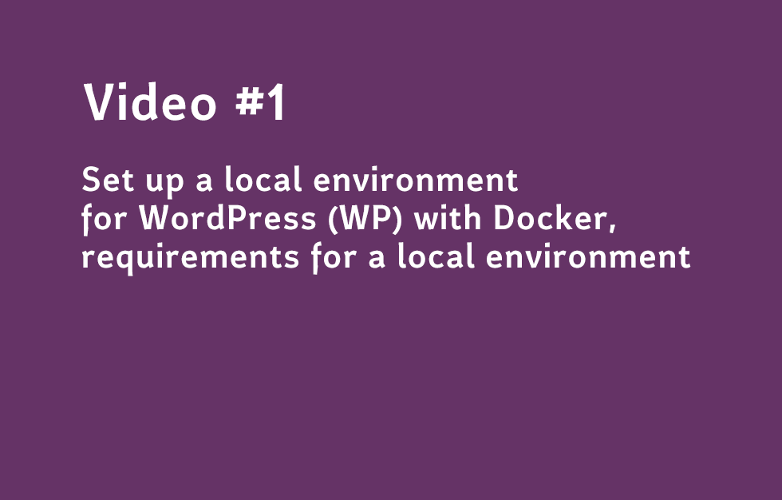
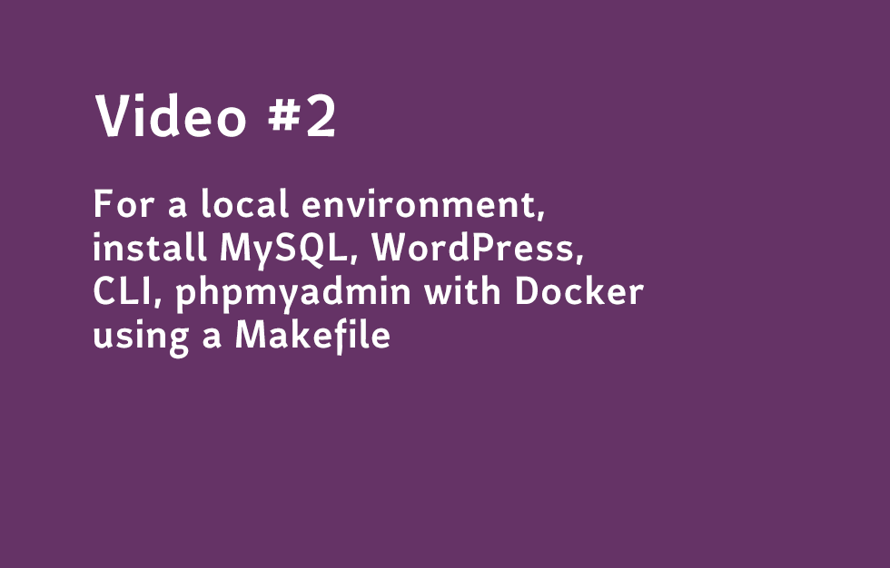
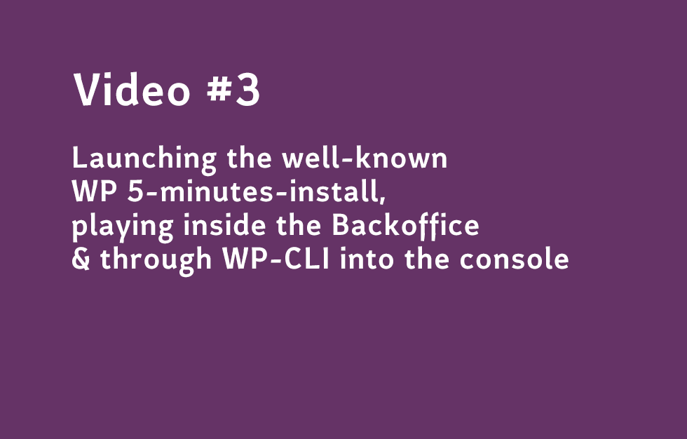

# Book #1: The good and small "Zambian" guide for WordPress. How to run a News Website with WordPress?

**Below you can find information and code about this book for sale on Amazon: [https://www.amazon.com/dp/B08645F8DZ/](https://www.amazon.com/dp/B08645F8DZ/)**

[](https://www.amazon.com/dp/B08645F8DZ/)


## Foreword
The 3 volumes of the continuous learning trilogy provide a practical synthesis on the best practices I gained as Trainer and Product Owner (P.O) of web application in the Media industry.  

- Book #1: The good and small "Zambian" guide for WordPress. How to run a News Website with WordPress?

- Book #2:  Defining a testing automation strategy for a P.O. with CODECEPTION_ & WordPress

- Book #3: Redefining a testing automation strategy for a P.O. with CodeceptJS & WordPress

1.  The Book #1 gathers all the materials that I brought with me to deliver a training session in Zambia to a team of journalists from the domestic network ZNBC on how to manage and run a news website. I made as intuitive and operational as possible. It has been transposed mostly to WordPress so anyone can leverage on it. It entails good practices under constraints such as budget, technical environment and team resources.

2.  The Book #2 & Book #3 present my understanding and practical experience of web application testing that I gained as Product Owner (P.O) in the Media industry. In these two books, I focus on user acceptance testing that is one of the biggest challenges for a PO of a large web application (back office, website).  How to minimize the risks of the acceptance phase?  How to master its duration? How to avoid regressions and side effects. Book #2 & Book #3 aim at answering those questions with the help of CP (Codeception) and CPJS (CodeceptJS).


## The continuous learning trilogy

### Book #1
**The good and small "Zambian" guide for WordPress. How to run a News Website with WordPress?**

- Github: [https://github.com/bflaven/book-small-guide-zambia-wordpress-running-news-website](https://github.com/bflaven/book-small-guide-zambia-wordpress-running-news-website)
- Amazon: [https://www.amazon.com/dp/B08645F8DZ/](https://www.amazon.com/dp/B08645F8DZ/)

### Book #2
**Defining a testing automation strategy for a P.O. with CODECEPTION_ & WordPress**
- Github: [https://github.com/bflaven/book-defining-testing-strategy-agile-po-codeception](https://github.com/bflaven/book-defining-testing-strategy-agile-po-codeception)
- Amazon: [https://www.amazon.com/dp/B0864VS2Y6/](https://www.amazon.com/dp/B0864VS2Y6/)

### Book #3
**Redefining a testing automation strategy for a P.O. with CodeceptJS & WordPress**
- Github: [https://github.com/bflaven/book-redefining-testing-strategy-agile-po-codeceptjs](https://github.com/bflaven/book-redefining-testing-strategy-agile-po-codeceptjs)
- Amazon: [https://www.amazon.com/dp/B0865TT96K/](https://www.amazon.com/dp/B0865TT96K/)

## Videos

**All the videos of this Book #3 are available on YouTube in this playlist: [https://bit.ly/3bDSF2x](https://bit.ly/3bDSF2x)**

- [Video #1 Set up a local environment for WordPress (WP), requirements for local environment](https://www.youtube.com/watch?v=YijmzQPiXcI)
[](https://www.youtube.com/watch?v=YijmzQPiXcI)


- [Video #2 For a local environment, install MySQL, WordPress, CLI, phpmyadmin with Docker using a Makefile ](https://www.youtube.com/watch?v=Bel7dcK4aSQ)
[](https://www.youtube.com/watch?v=Bel7dcK4aSQ)

- [Video #3 Launching the well-known WP 5-minutes-install, playing inside the Backoffice & through WP-CLI into the console](https://www.youtube.com/watch?v=xV4ZueOnoyA)
[](https://www.youtube.com/watch?v=xV4ZueOnoyA)


## Book Introduction

**It begins in Zambia**

I was asked to deliver a training session in Zambia for the Zambia National Broadcasting Corporation (ZNBC) about the best practices on the management of a news website based from my experience as a Product Owner within the digital department in the media group France Médias Monde (FMM).

However, the digital department where I worked is composed by several teams that work according to agile principles such as sprints, dashboards, stakeholders, PO, rituals... and so on. These teams are developing the website, API and back-office mostly using a PHP Framework like Symfony as well as some other frameworks for mobile applications both on iOS and Android. 

But not every organisation can afford such platforms. In Zambia, for instance, the ZNBC website is running on WordPress. Indeed, WordPress is very widespread and has great references in the Media industry such as TechCrunch, The New Yorker, BBC America, Bloomberg Professional., The Official Star Wars Blog, Variety, Sony Music, MTV News...to name a few. 

This is why I had to transpose the best practices of a large agile organisation working with Symfony into a WordPress environment.

This book a comprehensive guide to manage with agility an API centric ecosystem both for website and mobile application.This book does not have the goal neither to deliver a theoretical knowledge not to teach you programming but it provide you with a practical handbook on the management of a successful news website through WordPress for someone with moderate technical background and strong professional interest.


## Code
**I try not to forget anything. The best thing to do is to make a fresh installation of CodeCeption (CP), finalize the configuration and then cut and paste the testing files one after the other with a WP running on custom URL in MAMP.**

``` bash
.
├── 10_testing_wp # Chap 10
├── 11_conclusion # Chap 11
├── 1_introduction # Chap 1
├── 2_agile_methodology_quick_intro # Chap 2
├── 3_editorial_matters # Chap 3
├── 4_testing_the_wp_api # Chap 4
├── 5_zambia_plugins # Chap 5
├── 6_security_in_wp # Chap 6
├── 7_set_up_a_local_environment # Chap 7
├── 8_using_gitflow # Chap 8
├── 9_speeding_up_your_websites # Chap 9
└── README.md #This file

```

## Table of content

### 1_introduction
    Foreword

### 2_agile_methodology_quick_intro
    In the midst of Agile Methodology
    1. Behind the scene
    2. Play Agile
    3. Do you speak Agile?
    4. Boards
    5. Graphic facilitation
    6. Wireframing
    7. Gherkin
    8. Feedback on Agility, few key things to remember
    9. Culture hack, Mindset, step forward in Digital Transformation
    10. More resources


### 3_editorial_matters
    Editorial it matters!
    1. Define a content strategy
        1.1 Evaluate
        1.2 Analyse
        1.3 Structure
        1.4 Fix
        1.5 Maintain
        1.6 Conclusion
    2. Increase traffic and Targeting new audiences and usages
    3. SEO cannot be an afterthought
        3.1 Visible On-Page Factors
        3.2 Invisible On-Page Factors
        3.3 External Factors
        3.4 Potential Search Engine Penalties
    4. Ten WP Specific actions for SEO
    5. Content Strategy for WordPress
    6. More resources

### 4_testing_the_wp_api
    1. What is API centric or API First?
    2. Using or not using WordPress?
    2.1 Why you may WANT to use WordPress
        2.1.1 You are already addicted to WordPress
        2.1.2 Content Management with WordPress
        2.1.3 Managing Users is not an issue
        2.1.4 Tons of Plugins
        2.1.5 WordPress is flexible
        2.1.6 WordPress is secured if... 
        2.1.7 Cost
        2.1.8 Common criticisms of Wordpress
    2.2 Why you may NOT WANT to use WordPress
        2.2.1 There is another platform 
        2.2.2 Flexibility Is NOT Important to You
        2.2.3 Your app needs to be highly real time
    3. Does WordPress can compete with Symfony or Laravel?
        3.1 Models = plugins
        3.2 Views = themes
        3.3 Controllers = template loader
    4. Let's try to explore the WP API

### 5_zambia_plugins
    Best practices in WP plugin development!
    1. Quick introduction to OOP and WordPress Plugins
    2. How does does it work in WP?
    3. Want more? Quick explanations on other OOP concepts
    4. Using Namespaces in WP plugin development
    5. Using composer in WP plugin development
    6. Use a boilerplate code in WP plugin development
    7. Touching for instance the database for WP
    8. Let's dive into our WP plugins examples
    9. Read more

### 6_security_in_wp
    Manage security in WP
    1. Make a todolist for your WP security
    2. In case of hacking
        3. Main security measures you can do or not...
        3.1 Modify the existing .htaccess of WP
        3.2 Add your own .htaccess for /wp-admin/
        3.3 Create the file .htpasswd and add the user mysuperuser
        3.4 Diagnose: Scanning the files of your previous WP
    4. A possible .htaccess for your WP
    5. Read more

### 7_set_up_a_local_environment
    Set up a local environment for WordPress (WP)
    1. Needs & Choice for local environment
    2. Using Docker for WordPress
    3. Launch the install of your WordPress with Docker
    4. Working with WP-CLI
    5. The ultimate docker commands
    6. More resources

### 8_using_gitflow
    Using GitFlow Workflow and SourceTree
    1. Introduction
    2. How-to set up a repository, locally and on Github?
    3. How-to initialize Gitflow for this repository?
    4. Create a feature branch in this repository
    5. Finish a feature branch in this repository
    6. Start a release branch
    7. Finish a release branch
    8. Create and Finish a Hotfix
    9. Conclusion
    10.Read more

### 9_speeding_up_your_websites
    1. How to increase the site speed of an existing website? (part 1)
    1.1 Speed, Speed... it is all about speed!
        1.2 How to Check Your WordPress Website Speed?
            1.2.1 Get some result
            1.2.2 One last advise for using such analysis tool.
        1.3 Enable Gzip compression
            1.3.1 Use a plugin to enable Gzip compression
            1.3.2 Edit your .htaccess file to enable Gzip compression
        1.4 Optimize Images
        1.5 Eliminate Render-blocking JavaScript and CSS
            1.5.1 The first solution
            1.5.2 The second solution
            1.5.3 The third solution
            1.5.4 We pick.... the second solution
        1.6 Optimize CSS delivery
        1.7 Leverage Browser Caching
        1.8 Reduce server response time
        1.9 Remove Query Strings from Static Resources with Code
        1.10 Use a CDN
            1.11 Optimize Your Database
            1.11.1 Some optimization queries for wp-config.php
            1.11.2 Some optimization queries for phpMyAdmin
            1.11.3 Control the revisions
            1.11.4 MySQL command to delete spam
            1.11.5 Delete WordPress Transient
            1.11.6 More information about MySQL optimization for WP
        1.12 What else?
            1.12.1 Few plugins to go further
            1.12.2 One short word on New Relic
            1.13 Extra infos on site speed optimization
            1.13.1 Speed tips from yahoo.com
            1.13.2 Speed tips from pantheon.io for WP
        1.14 Read more on WP optimization
    2. WP theme creation, Gulp, theme optimization & speed?
        2.1 Some requirements
        2.2 Gulp for WordPress: Initial Setup
        2.3 Create a starter theme named zambia-wp-test-1
        2.4 Let's play with Gulp for a minutes
        2.5 Do some Gulp task for CSS
        2.6 Do some Gulp task for images
        2.7 Create a task that will delete the destination folder
        2.8 Using NPM to start Gulp
        2.9 Using Browsersync
        2.10 More resources


### 10_testing_wp
    Testing Wordpress

### 11_conclusion
    Conclusion

### Resources
    Code avalaible

### Lexicon
    Some Definitions


